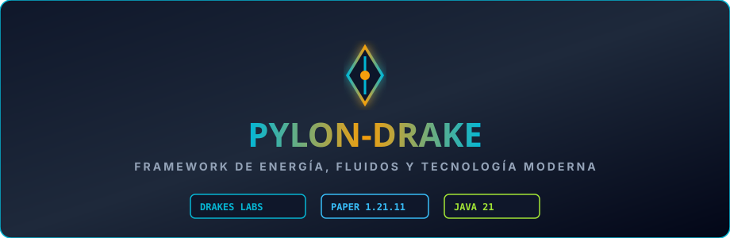

  

# Pylon-Drake

Fork de mantenimiento y compatibilidad de **Pylon**, un avanzado framework tecnológico para Minecraft que añade **redes eléctricas, motores diésel, tuberías dinámicas de fluidos, fundiciones y logística industrial**. Mantenido por **DrakesCraft Labs** para Paper/Purpur 1.21.11 en Java 21.

---

## 🎯 Objetivo

Ofrecer una alternativa modular y moderna de maquinaria y fluidos construida sobre el framework Rebar, con soporte de localización multi-idioma por jugador y rendimiento nativo.

---

## ⚡ Características Principales

- **Redes de Energía y Electricidad**:
  - Cableado, transformadores y generadores de combustión.
- **Dinámica de Fluidos y Tuberías**:
  - Transporte y almacenamiento de petróleo, vapor y líquidos industriales en tanques transparentes.
- **Guía Interactiva y Traducción por Jugador**:
  - Cada usuario puede visualizar los tutoriales e interfaces en su idioma nativo.

---

## 🛠️ Entorno y Dependencias

- **Servidor**: Paper / Purpur 1.21.11
- **Java**: 21
- **Dependencia Core**: `Rebar-Drake`
